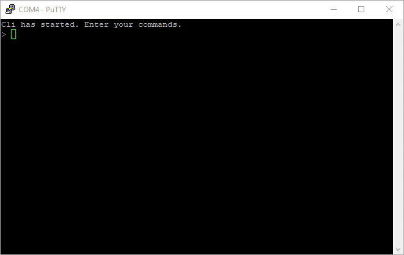

# Embedded CLI

[](https://codecov.io/gh/funbiscuit/embedded-cli)

> [!NOTE]  
> This library is in maintenance mode. Take a look at full rewrite in Rust:
> [embedded-cli-rs](https://github.com/funbiscuit/embedded-cli-rs).
> It has all features of this library and more: utf-8 support,
> lower memory usage, static dispatch and argument parsing.

Single-header CLI library intended for use in embedded systems (like STM32 or Arduino).



## Features

* Dynamic or static allocation
* Configurable memory usage
* Command-to-function binding with arguments support
* Live autocompletion (see demo above, can be disabled)
* Tab (jump to end of current autocompletion) and backspace (remove char) support
* History support (navigate with up and down keypress)
* Limited cursor support (navigate inside input with left and right keypress)
* Any byte-stream interface is supported (for example, UART)
* Single-header distribution

## Integration

* You'll need to download embedded_cli.h single-header version from Releases tab. Or you can build it yourself (run
  build-shl.py python script while inside `lib` directory)
* Add embedded_cli.h to your project (to one of the include directories)
* Include embedded_cli.h header file in your code where you need cli functionality:

```c
#include "embedded_cli.h"
```

* In one (and only one) compilation unit (.c/.cpp file) define macro to unwrap implementations:

```c
#define EMBEDDED_CLI_IMPL
#include "embedded_cli.h"
```

### Initialization

To create CLI, you'll need to provide a desired config. Best way is to get default config and change desired values. For
example, change maximum amount of command bindings:

```c
EmbeddedCliConfig *config = embeddedCliDefaultConfig();
config->maxBindingCount = 16;
```

Create an instance of CLI:

```c
EmbeddedCli *cli = embeddedCliNew(config);
```
If default arguments are good enough for you, you can create cli with default config:
```c
EmbeddedCli *cli = embeddedCliNewDefault();
```
Provide a function that will be used to send chars to the other end:
```c
void writeChar(EmbeddedCli *embeddedCli, char c);
// ...
cli->writeChar = writeChar;
```

After creation, provide desired bindings to CLI (can be provided at any point in runtime):
```c
embeddedCliAddBinding(cli, {
        "get-led",          // command name (spaces are not allowed)
        "Get led status",   // Optional help for a command (NULL for no help)
        false,              // flag whether to tokenize arguments (see below)
        nullptr,            // optional pointer to any application context
        onLed               // binding function 
});
embeddedCliAddBinding(cli, {
        "get-adc",
        "Read adc value",
        true,
        nullptr,
        onAdc
});
```
Don't forget to create binding functions as well:
```c
void onLed(EmbeddedCli *cli, char *args, void *context) {
    // use args as raw null-terminated string of all arguments
}
void onAdc(EmbeddedCli *cli, char *args, void *context) {
    // use args as list of tokens
}
```
CLI has functions to easily handle list of space separated arguments. If you have null-terminated string
you can convert it to list of tokens with single call:
```c
embeddedCliTokenizeArgs(args);
```

**Note**: This function will need to make args string double null-terminated Initial array will be modified (so it must
be non const), do not use it after this call directly. After that you can count arguments or get single argument as a
null-terminated string:

```c
const char * arg = embeddedCliGetToken(args, pos); // args are counted from 1 (not from 0)

uint8_t pos = embeddedCliFindToken(args, argument);

uint8_t count = embeddedCliGetTokenCount(const char *tokenizedStr);
```

Examples of tokenization:

| Input             | Arg 1      | Arg 2  | Comments                                         |
|-------------------|------------|--------|--------------------------------------------------|
| abc def           | abc        | def    | Space is treated as arg separator                |
| "abc def"         | abc def    |        | To use space inside arg surround arg with quotes |
| "abc\\" d\\\\ef"  | abc" d\\ef |        | To use quotes or slashes escape them             | 
| "abc def" test    | abc def    | test   | You can mix quoted args and non quoted           |
| "abc def"test     | abc def    | test   | Space between quoted args is optional            |
| "abc def""test 2" | abc def    | test 2 | Space between quoted args is optional            |

### Runtime

At runtime you need to provide all received chars to cli:

```c
// char c = Serial.read();
embeddedCliReceiveChar(cli, c);
```

This function can be called from normal code or from ISRs (but don't call it from multiple places). This call puts char
into internal buffer, but no processing is done yet.

To do all the "hard" work, call process function periodically
```c
embeddedCliProcess(cli);
```

Processing should be called from one place only and it shouldn't be inside ISRs. Otherwise, your internal state might
get corrupted.

### Static allocation
CLI can be used with statically allocated buffer for its internal structures. Required size of buffer depends on CLI
configuration. If size is not enough, NULL is returned from ```embeddedCliNew```. To get required size (in bytes) for
your config use this call:
```c
uint16_t size = embeddedCliRequiredSize(config);
```

On some architectures (for example, on some ARM devices) it is important that allocated buffer is aligned properly.
Because of that, `cliBuffer` uses type specific for used platform (16bit on AVR, 32bit on ARM, 64bit on amd64). Actual
integer type used to build `cliBuffer` is defined in macro `CLI_UINT`. Note that required size in bytes should be
divided by size of `CLI_UINT`, or you can use macro `BYTES_TO_CLI_UINTS(CLI_BUFFER_SIZE)`. Create a buffer of required
size and provide it to CLI:
```c
CLI_UINT cliBuffer[BYTES_TO_CLI_UINTS(CLI_BUFFER_SIZE)];
// ...
config->cliBuffer = cliBuffer;
config->cliBufferSize = CLI_BUFFER_SIZE;
```
If ```cliBuffer``` in config is NULL, dynamic allocation (with malloc) is used.
In such case size is computed automatically.


## User Guide
You'll need to begin communication (usually through a UART) with a device running a CLI.
Terminal is required for correct experience. Following control sequences are reserved:
* \r or \n sends a command (\r\n is also supported)
* \b removes last typed character
* \t moves cursor to the end of autocompleted command
* Esc[A (key up) and Esc[B (key down) navigates through history
* Esc[C (key right) and Esc[D (key left) moves the cursor left and right

If you run CLI through a serial port (like on Arduino with its UART-USB converter),
you can use for example PuTTY (Windows) or XTerm (Linux).

## Examples
There is an example for Arduino (tested with Arduino Nano, but should work on anything with at least 1kB of RAM).
Look inside examples directory for a full code.
